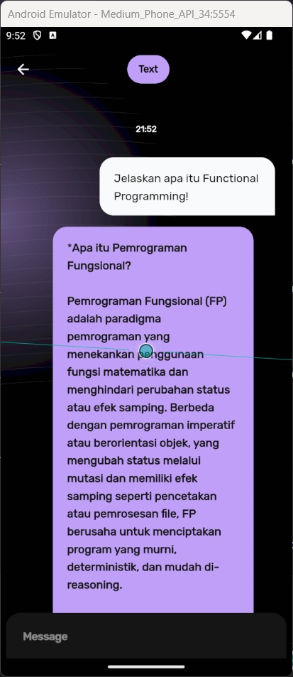
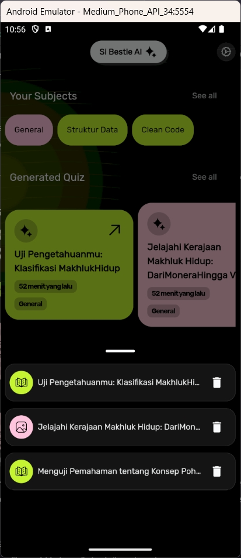

[![Contributors][contributors-shield]][contributors-url]

[![Forks][forks-shield]][forks-url]

[![Stargazers][stars-shield]][stars-url]

[![Issues][issues-shield]][issues-url]

[![MIT License][license-shield]][license-url]

<br />

<div  align="center">

<a  href="https://github.com/codeyzx/sibestie">


</a>

<h3  align="center">Si Bestie</h3>

<p  align="center">

Si Bestie is your go-to study buddy infused with AI smarts to enhance your learning journey. It's designed to simplify studying with features like "Create Study Space" for easy access to your materials, and "Ask Bot" for quick clarifications. Plus, it offers quizzes, flashcards, and summaries tailored to your needs. With the "User Activity History," tracking progress is a breeze. Si Bestie is here to make learning simpler, more efficient, and enjoyable for you.

<br/>
<br/>

<a  href="#demo">View Demo</a>
·
<a  href="https://github.com/codeyzx/sibestie/issues">Report Bug</a>
·
<a  href="https://github.com/codeyzx/sibestie/issues">Request Feature</a>

</p>

</div>

## About The Project


### Built With

<!-- row images -->
<div>
  <a href="https://flutter.dev/">
    
  </a>
  <a href="https://riverpod.dev/">
    
  </a>
  <a href="https://docs.hivedb.dev/">
    
  </a>
</div>

## Features

### 1. Study Space

  
  

The core feature of SiBestie is the "Study Space" This feature allows users to create personalized study sessions based on their learning materials. Users can start a study session by uploading their study materials, such as PDFs or Word documents. They can then interact with an AI to ask questions about the material, enhancing their understanding.

**How to Use:**

1. Open the Si Bestie App and navigate to the home.
2. Select the "Create Your Study Space" button.
3. Select button "Attach PDF" and Upload the study material file, don't forget to fill out the title of subject.
4. Begin the study session and ask questions to the AI about the material.

### 2. Chat with AI

  

The "Chat with AI" feature enables users to interact with an AI to get answers to their questions quickly and easily. It provides a convenient way for users to receive information without having to search for it themselves.

**How to Use:**

1. Open the Si Bestie App and navigate to the home.
2. Choose the "Chat with AI" option to start a conversation with the AI.
3. Type your question and wait for the bot's response.

### 3. Ask Image

  
  

With the "Ask Image" feature, users can upload images and ask the AI questions about them. This feature allows users to gain more information or explanations about the images they encounter.

**How to Use:**

1. Open the Si Bestie App and navigate to the dashboard.
2. Select the "Ask Image" button.
3. Upload the image.
4. Ask your question about the image and wait for the bot's response.

### 4. Saved History Activity

  

The "Saved History Activity" feature stores all user activities in the app for easy access. Users can view and manage their saved learning activities within the app.

**How to Use:**

1. Open the Si Bestie App and navigate to the dashboard.
2. Just click the "See All" button to view all your saved activities (quiz/flashcard/chat).

### 5. Quiz

  
  

The "Quiz" feature generates questions and answers based on the uploaded study materials. It helps users test their understanding of the material they are studying.

**How to Use:**

1. Open the Si Bestie App and navigate to the dashboard.
2. Create a study space and upload your study materials.
3. Select the icon "✨" and choose the "Generate Quiz" option.
4. Start the quiz and answer the questions.

### 6. Flashcard

  
  

The "Flashcard" feature creates flashcards based on the uploaded study materials. It assists users in deepening their understanding of the material.

**How to Use:**

1. Open the Si Bestie App and navigate to the dashboard.
2. Create a study space and upload your study materials.
3. Select the icon "✨" and choose the "Generate Flashcard" option.
4. Start the flashcard session and view the questions and answers.

### 7. Summary

  
  

The "Summary" feature generates summaries of the studied materials based on the uploaded files. It helps users remember key information from their study materials.

**How to Use:**

1. Open the Si Bestie App and navigate to the dashboard.
2. Create a study space and upload your study materials.
3. Select the icon "✨" and choose the "Generate Summary" option.
4. Start the summary session and view the generated summaries.

## Technologies Used

- **Flutter**: Cross-platform framework for building native mobile applications.
- **Dio**: HTTP client for making API requests.
- **Hive**: NoSQL database for local data storage.
- **Flutter Riverpod**: State management library for managing app-wide state.
- **Syncfusion Flutter PDF**: Library for creating and viewing PDF documents.

## Getting Started

1. Clone the repository:

   ```sh
   git clone https://github.com/codeyzx/sibestie.git
   ```

2. Install dependencies:

   ```sh
   flutter pub get
   ```

3. Run the application:

   ```sh
   flutter run
   ```

## Created by JTK Team

- Yahya Alfon Sinaga
- Daiva Raditya Pradipa
- Athalie Aurora Puspanegara
- Rafka Imanda Putra
- M. Amadeus Andika Fadhil

## Demo

| Welcome                                    | Home                                       |
| ------------------------------------------ | ------------------------------------------ |
|  |  |

| Home                                       | Chat With AI                               |
| ------------------------------------------ | ------------------------------------------ |
|  |  |

| Ask Image                                    | Ask Image (View Image)                                   |
| ------------------------------------------ | ------------------------------------------ |
|  |  |

| Study Space (asking)                                    | Study Space (actions)                                   |
| ------------------------------------------ | ------------------------------------------ |
|  |  |

| Quiz                                    | Quiz (selected)                                   |
| ------------------------------------------ | ------------------------------------------ |
|  |  |

| Flashcard (question)                                    | Flashcard (answer)                                    |
| ------------------------------------------ | ------------------------------------------ |
|  |  |

## License

Distributed under the MIT License. See `LICENSE.txt` for more information.

[contributors-shield]: https://img.shields.io/github/contributors/codeyzx/sibestie.svg?style=for-the-badge
[contributors-url]: https://github.com/codeyzx/sibestie/graphs/contributors
[forks-shield]: https://img.shields.io/github/forks/codeyzx/sibestie.svg?style=for-the-badge
[forks-url]: https://github.com/codeyzx/sibestie/network/members
[stars-shield]: https://img.shields.io/github/stars/codeyzx/sibestie.svg?style=for-the-badge
[stars-url]: https://github.com/codeyzx/sibestie/stargazers
[issues-shield]: https://img.shields.io/github/issues/codeyzx/sibestie.svg?style=for-the-badge
[issues-url]: https://github.com/codeyzx/sibestie/issues
[license-shield]: https://img.shields.io/github/license/othneildrew/Best-README-Template.svg?style=for-the-badge
[license-url]: https://github.com/codeyzx/sibestie/blob/main/LICENSE.txt
