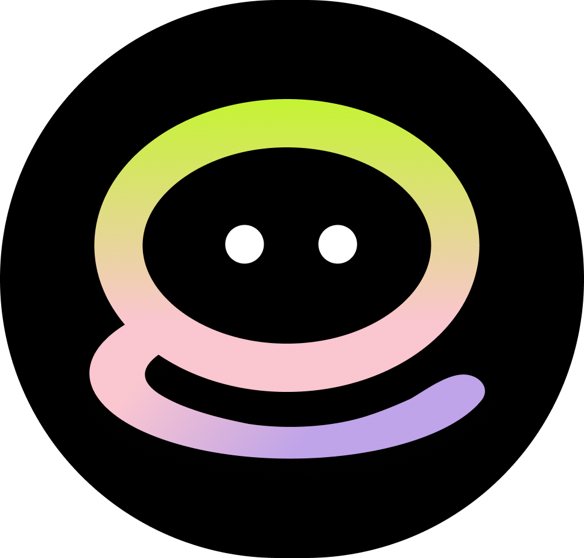

[![Contributors][contributors-shield]][contributors-url]

[![Forks][forks-shield]][forks-url]

[![Stargazers][stars-shield]][stars-url]

[![Issues][issues-shield]][issues-url]

[![MIT License][license-shield]][license-url]

<br />

<div  align="center">

<a  href="https://github.com/codeyzx/sibestie">



</a>

<h3  align="center">Si Bestie</h3>

<p  align="center">

Si Bestie is your go-to study buddy infused with AI smarts to enhance your learning journey. It's designed to simplify studying with features like "Create Study Session" for easy access to your materials, and "Ask Bot" for quick clarifications. Plus, it offers quizzes, flashcards, and summaries tailored to your needs. With the "User Activity History," tracking progress is a breeze. Si Bestie is here to make learning simpler, more efficient, and enjoyable for you.

<br/>
<br/>

<a  href="https://github.com/codeyzx/sibestie">View Demo</a>
·
<a  href="https://github.com/codeyzx/sibestie/issues">Report Bug</a>
·
<a  href="https://github.com/codeyzx/sibestie/issues">Request Feature</a>

</p>

</div>

## Features

### 1. Create Study Sessions

Dive into personalized learning adventures with Si Bestie's flagship feature. Upload your study materials, whether they're PDFs, Word documents, or other formats, and let AI guide you through interactive study sessions. Ask questions, request quizzes, flashcards, or summaries tailored to your study material, and make learning a breeze.

### 2. Ask AI

Say goodbye to confusion! With Si Bestie, you can directly query our AI about any topic you're studying. Get clear, concise answers that demystify complex concepts and fuel your understanding.

### 3. Ask Image

A picture is worth a thousand words, and Si Bestie understands that. Upload images related to your studies and ask AI questions about them. It's like having your own personal tutor decoding visuals for you.

### 4. Test Your Knowledge

Time to put your learning to the test! Si Bestie offers quizzes, flashcards, and summaries crafted from your uploaded materials. Strengthen your grasp on subjects, reinforce key concepts, and boost information retention effortlessly.

### 5. Track Your Progress

Keep tabs on your learning journey with Si Bestie's User Activity History feature. Review past study sessions, bot interactions, or image inquiries to evaluate your progress and tailor your learning path accordingly.

## Technologies Used

- **Flutter**: Cross-platform framework for building native mobile applications.
- **Dio**: HTTP client for making API requests.
- **Hive**: NoSQL database for local data storage.
- **Flutter Riverpod**: State management library for managing app-wide state.
- **Syncfusion Flutter PDF**: Library for creating and viewing PDF documents.

## Getting Started

1. Clone the repository:

   ```sh
   git clone https://github.com/codeyzx/sibestie.git
   ```

2. Install dependencies:

   ```sh
   flutter pub get
   ```

3. Run the application:

   ```sh
   flutter run
   ```

## License

Distributed under the MIT License. See `LICENSE.txt` for more information.

## Created by JTK Team

- Yahya Alfon Sinaga
- Daiva Raditya Pradipa
- Athalie Aurora Puspanegara
- Rafka Imanda Putra
- M. Amadeus Andika Fadhil

[contributors-shield]: https://img.shields.io/github/contributors/codeyzx/sibestie.svg?style=for-the-badge
[contributors-url]: https://github.com/codeyzx/sibestie/graphs/contributors
[forks-shield]: https://img.shields.io/github/forks/codeyzx/sibestie.svg?style=for-the-badge
[forks-url]: https://github.com/codeyzx/sibestie/network/members
[stars-shield]: https://img.shields.io/github/stars/codeyzx/sibestie.svg?style=for-the-badge
[stars-url]: https://github.com/codeyzx/sibestie/stargazers
[issues-shield]: https://img.shields.io/github/issues/codeyzx/sibestie.svg?style=for-the-badge
[issues-url]: https://github.com/codeyzx/sibestie/issues
[license-shield]: https://img.shields.io/github/license/othneildrew/Best-README-Template.svg?style=for-the-badge
[license-url]: https://github.com/codeyzx/sibestie/blob/main/LICENSE.txt
